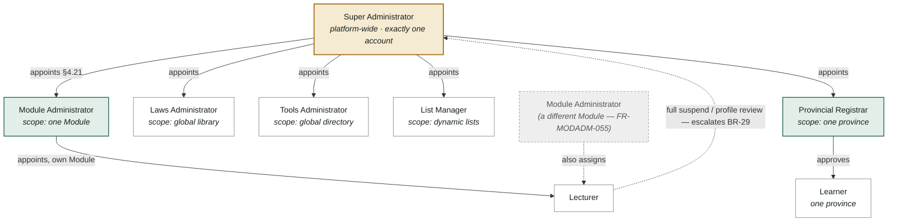
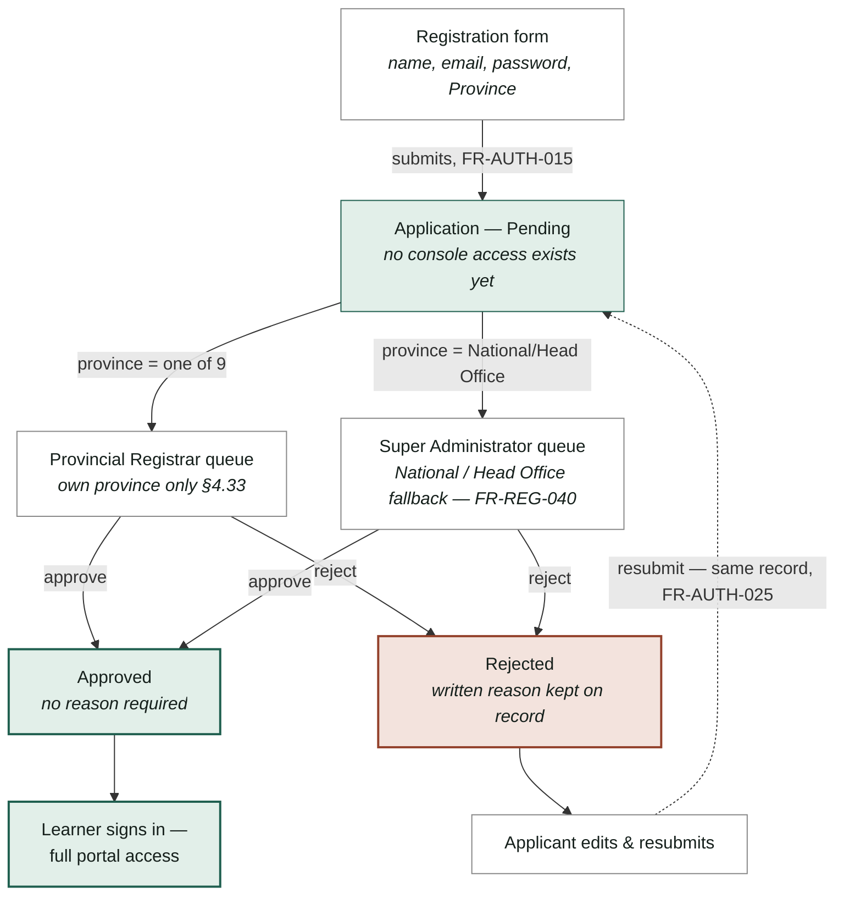
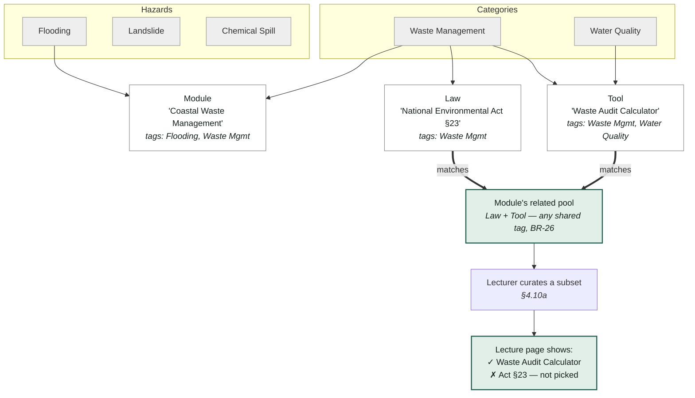
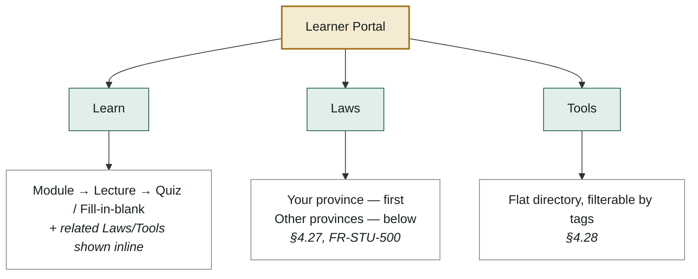

# Ministry Pivot Architecture — Diagrams

Companion to `docs/SRS.md` (revision 0.2, 2026-09-13). Covers §1.2, §4.2, §4.10a, §4.27–4.33, §6 (BR-26–32), §7. Each diagram also exists as a standalone `.mmd` file in this folder for tools that want raw Mermaid source instead of a fenced block.

---

## 01 — Scope & ownership map

The old flat Administrator is gone. Every one of its jobs now sits with exactly one of six roles, and each role's authority stops at a hard boundary: one Module, one global library, one province, or the whole platform.

The one recurring exception: a Lecturer can be assigned across *several* Module Administrators' modules at once, so nobody with only one Module's authority may lock that person's whole account, or decide whether their profile review goes public. Both escalate to the Super Administrator — the dashed line below (**BR-29**).

**Reads as:** the Super Administrator appoints all five scoped roles; a Module Administrator's authority over a Module never reaches the Lecturer's whole account, because that Lecturer may answer to more than one Module Administrator at once — full-account actions climb to the one role with undivided ownership instead (SRS §4.17–§4.20, §7).

---

## 02 — Registration, review, and resubmission

No public self-signup. A submitted application sits pending until one human decides it — routed by province, with the fixed "National / Head Office" choice falling to the Super Administrator instead of a province that doesn't apply.

Rejection isn't terminal: the applicant edits and resubmits the *same* record rather than starting a second, duplicate one (**FR-AUTH-025**).

**Reads as:** exactly one human decision gates sign-in; email confirmation was deliberately dropped as a redundant second gate (SRS §4.2).

---

## 03 — Tag-based relatedness, from pool to lecture

There is no hand-maintained "this Law belongs to this Module" table. A Module, a Law, and a Tool are related purely because they share at least one value from a dynamic option list — Hazards, Categories, and whatever gets added later.

A lecturer then narrows that automatic pool down to whatever's actually worth a learner's attention on *one* lecture — a deliberate, hand-picked subset, shown here with a worked example. (Example content is illustrative only, matching the SRS's own convention.)

**Reads as:** the pool is automatic and inclusive (an OR-match — **BR-26**); what a learner actually sees on a lecture is a deliberately smaller, hand-picked set — here the Tool made the cut for this lecture, the Law didn't.

---

## 04 — Learn, Laws, and Tools

The portal keeps its existing Learn experience unchanged and adds two standing, top-level tabs alongside it — full directories, not scoped views, though both link back into whatever Module or Lecture context brought a learner there.

**Reads as:** Learn is unchanged in kind, only gaining inline pointers out to the other two tabs; Laws and Tools are new, standing, platform-wide sections, not sub-pages of a Module.

---

Field-level data model, the full role/permission matrix, and every numbered requirement behind these diagrams live in `docs/SRS.md` (§7, §8). Open items — the List Manager's future, multi-registrar provinces, National/Head Office ordering on the Laws tab — are tracked in Appendix D there.
